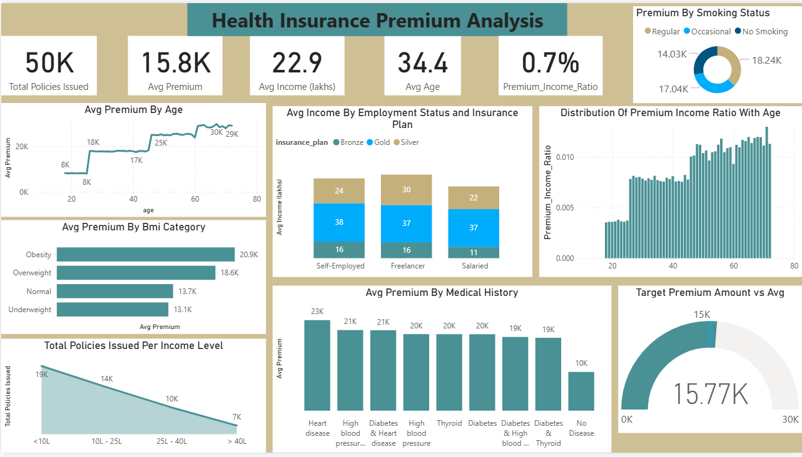
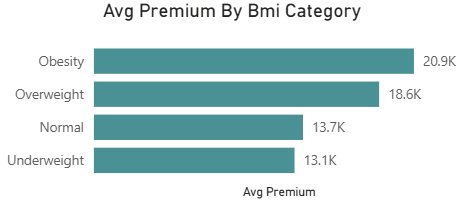
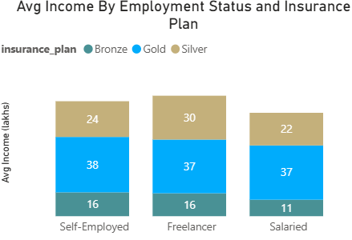
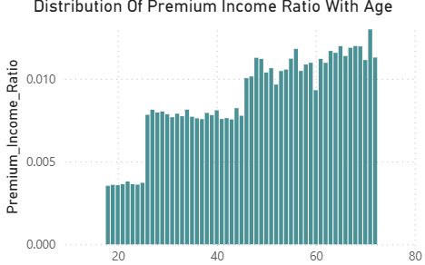
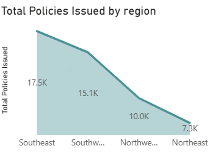
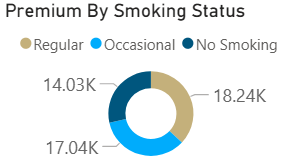

  
Banner [source](https://banner.godori.dev/)

# Health Insurance Premium Calculator:

##### App Link: [Healthrate - Live Insurance Premium Estimator](https://healthrate.onrender.com)
##### Dashboard Link: [Power BI Dashboard](https://app.powerbi.onrender.com)

---

## 🔍 Business Problem:
Rising health insurance costs have made it difficult for individuals to estimate how much they might need to pay each year. With premiums influenced by a range of personal factors—like age, medical history, and lifestyle—many people are left guessing. This project aims to bring clarity by offering a simple, data-driven tool that helps users understand what goes into their health insurance costs and what to expect financially.

--- 

## Overview:
An intelligent, real-time health insurance premium predictor designed to help individuals estimate their annual premiums based on their health conditions, age, income, and more. Get Realtime Insurance estimations using this project.

---

## Power BI Dashboard:

**A Real-Time Dynamic Power Bi Dashboard for Analyzing How Health Insurance Premiums Differes from regions, Health,employment smoking status etc.**

--- 

# Key Insights:

## 1. Age vs Premium:

**This Line chart shows how the premium costs varies across different age groups.Younger individuals tend to pay lower insurance premiums, whereas premiums significantly increase with age.**

## 2. BMI Category Impact:

**Insurance premiums are higher for individuals classified as Overweight or Obese, while those with a Normal or Underweight BMI enjoy lower premium rates.**

## 3. Income Level Distribution:

**A majority (38%) of policyholders have an income below ₹10 lakhs. Only 16% of policy holders have income more than ₹30 lakhs.**

## 4. Employemnt Type & Insurance Plan:

**Freelancers have the highest average income, followed by Self-Employed and then Salaried professionals. Most Gold plans are opted for by the Self-Employed, Silver by Freelancers, and Bronze by Salaried individuals.**

## 5. Premium Income Ratio [PIR]:

**The Premium Income Ratio indicates a persons income towards their insurance premium. For age groups less than 40 PIR is less meaning the premium is more affordable, For people with more than 40 Age the PIR is High indicating higher insurance costs with respect to their income.**

## 6. Region Policy Distribution:

**The Southeast region accounts for the highest share of policies (35%), followed by Southwest (33%), Northwest (20%), and Northeast (14%).**

## 7. Smoking Habits & Premium Costs:

**Regular smokers pay significantly higher premiums, followed by occasional smokers. Non-smokers benefit from the lowest premium rates.**

--- 

# ⚙️ Tech Stack:
- Python (3.10+)
- Pandas, NumPy, Matplotlib, Seaborn
- Scikit-learn, XGBoost
- Streamlit (UI)
- RandomizedSearchCV (for model tuning)
- Render (Deployment) 

---

## Methods:

### 📥 Data Preprocessing
- Dropped null values and handled duplicates, fixed column values datatypes etc.
- Plotted Box plots for visualizing outliers and dropped some outliers by domain knowledge.

### 📊 EDA
- Histograms, box plots used for univariate analysis.
- BarPlots, scatter plots and cross-tabs for bivariate insights.

### 🧠 Feature Engineering
- Created `risk_score` feature from domain-specific medical history column.
- Encoded categorical features via One-Hot and Manual Label Mapping.

### 🧮 Feature Selection & Scaling
- Dropped multicollinear features using VIF.
- Applied Min-Max scaling for consistent range.

### 🤖 Model Development
- Trained Linear, Ridge, and XGBoost regressors.
- XGBoost selected for best R² performance (0.98).

### 🔀 Model Segmentation
-- Showed Significant error margin (16%) for younger age groups.
-- Trained another model consisting of age groups less than 25.

### 🛠️ Model Tuning
- Used RandomizedSearchCV for hyperparameter optimization.

---

## 📈 Evaluation Metrics
- **R² Score (XGBoost):** 0.98  
- **Error Margin:** Minimized after age-wise segmentation.  
- **Feature Impact:** Income, risk_score, and genetical_risk were most influential features.
- **Model Strategy:** For Real Time Predictions, If the selected age is over 25, it uses one model to show results. If it's above 25 it uses a different model.

---

## 📌 Top Conclusions:
- Premiums are strongly influenced by medical history and income level.
- Segmented model approach significantly improved younger user predictions.
- Adding domain-specific features resulted in a more generalized model.

---
> 🚀 **Final solution: A dual-model XGBoost system optimized for different age groups, served through an interactive and responsive Streamlit app.**
=======

